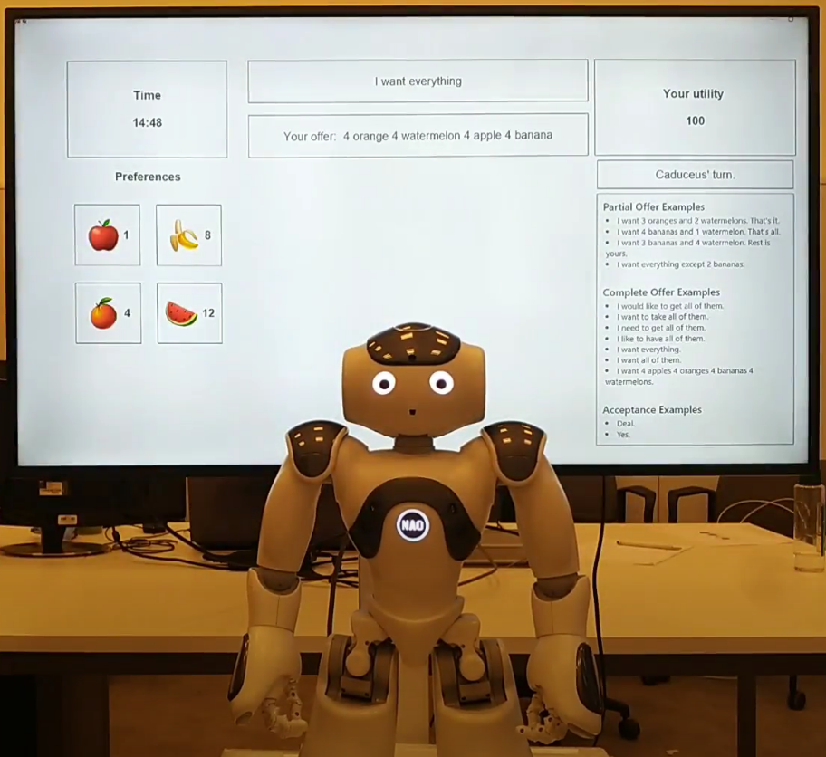
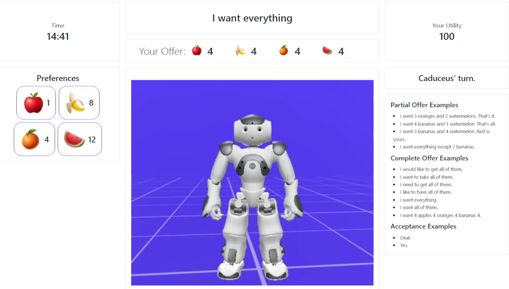
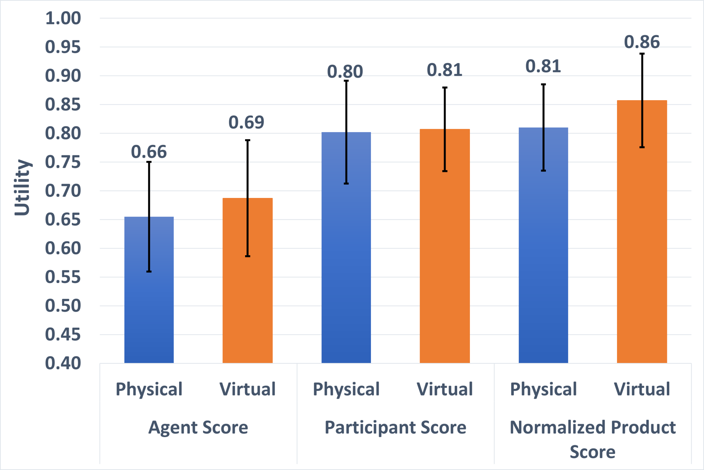

# Effects of Agent's Embodiment in Human-Agent Negotiations — [IVA 2023]

Umut Çakan · Mehmet Onur Keskin · Reyhan Aydoğan

[Paper](https://doi.org/10.1145/3570945.3607362) · [Explore the method](METHOD.md) · [Try the code](#try-it-yourself) · [Study guide](docs/protocol.md) · [Citation](#cite-the-paper)

[](https://github.com/monurkeskin/Effects-of-Agents-Embodiment-IVA-2023/actions/workflows/tests.yml)
[](https://codecov.io/gh/monurkeskin/Effects-of-Agents-Embodiment-IVA-2023)

Would you bargain differently with a robot sitting across the table than with
the same agent on a screen? **Caduceus keeps the negotiation strategy, gestures
and arguments common while changing the agent's embodiment.** The study examines
both the resulting offers and how people perceive their partner.

| Physical Caduceus | Virtual Caduceus |
| --- | --- |
|  |  |

*Figure 2 from the paper. These are the two original study settings. The browser
avatar in today's demo provides an accessible way to try the interaction; it is
not the study's recorded virtual stimulus.*

## Same bargaining task, two embodiments

Participants divide four units of each of four fruits: **625 possible allocations**.
They experience both embodiments in counterbalanced order, with a five-minute
break. Caduceus uses a hybrid time/behavior strategy. The point assignments change
between sessions while retaining the same structure:

| Points per fruit | Session 1: human | Session 1: agent | Session 2: human | Session 2: agent |
| --- | ---: | ---: | ---: | ---: |
| Watermelon | 12 | 4 | 4 | 12 |
| Banana | 8 | 1 | 1 | 8 |
| Orange | 4 | 12 | 12 | 4 |
| Apple | 1 | 8 | 8 | 1 |

*Table 2, transcribed from the paper. A bid gives the human's share; the agent
receives the remaining fruit. Each role's maximum score is 100.*

You can [recalculate the whole space](reproduction/profile-1.json) from this table,
then inspect the [second profile](reproduction/profile-2.json). The profile tests
check every allocation against these points.

## Outcomes and perceptions tell different parts of the story



*Figure 5. The outcome analysis uses 30 paired participants after the study's
exclusion rule. Means below are the published values, not a new experiment.*

| Published mean | Physical | Virtual |
| --- | ---: | ---: |
| Agent utility | 0.66 | 0.69 |
| Human utility | 0.80 | 0.81 |
| Normalized utility product | 0.81 | 0.86 |

The normalized product divides the two parties' utility product by the largest
possible product in this scenario, **0.64**. Its difference favored the virtual
condition ($p=0.03$), while individual utility comparisons were not significant.
The paper also reports more cooperative human moves with virtual Caduceus and
greater perceived humanlikeness for the physical robot.
[Paper Sections 5–6](https://doi.org/10.1145/3570945.3607362) ·
[Figure and table sources](docs/paper/README.md).

## What you can explore

Explore the fruit utility space, examine the two exact point profiles and follow a paired session sequence. Exhaustive profile checks cover all 625 allocations for each role and session.

| Explore | Start with | What it shows |
| --- | --- | --- |
| Fruit-sharing space | [reproduction/profile-1.json](reproduction/profile-1.json) | Recompute the full utility space from the paper's point table. |
| Second session | [reproduction/profile-2.json](reproduction/profile-2.json) | Inspect the changed profile assignment. |
| Embodiment protocol | [docs/protocol.md](docs/protocol.md) | Keep practice, order, breaks and exclusions distinct. |

The configurations, method checks and study guides are specific to this paper. The shared [NEGOTIATOR framework](https://github.com/monurkeskin/NEGOTIATOR-IJCAI-2024) runs the negotiation,
participant/conductor views and session analysis. Its exact **2.1.0** revision is
pinned in [framework.json](framework.json); installation brings it in automatically.

The browser avatar provides a convenient demonstration; it is not the recorded virtual robot used in the study. The maintained mood schedule follows a historical code variant that differs from the paper's stated warning times. [METHOD.md](METHOD.md) and the protocol guide identify the remaining presentation/protocol choices.

## Try it yourself

Use Python 3.11 or 3.12 and Git. This first example runs locally without a robot,
camera or service account.

```bash
git clone https://github.com/monurkeskin/Effects-of-Agents-Embodiment-IVA-2023.git
cd Effects-of-Agents-Embodiment-IVA-2023
python3 -m venv .venv
source .venv/bin/activate
python -m pip install -r requirements.txt
python run.py --output demo-output
```

On Windows, create the environment with `py -3 -m venv .venv` and activate it with
`.venv\Scripts\Activate.ps1` in PowerShell.

Open **`demo-output/report/index.html`** to follow the example negotiation. The
output includes offers, utility trajectories, session records and exportable
figures. These are synthetic examples for exploring the software and method.
[Installation help](docs/compatibility.md).

### Read a calculation or open the study workspace

```bash
negotiator reproduce reproduction/method.json --output method-output
negotiator gui
```

In **New study → Import a paper or study configuration**, select
`configs/synthetic.json` for the demonstration, or `configs/protocol-template.json`
to inspect the paper's protocol template. The [study guide](docs/protocol.md)
explains the remaining protocol/asset requirements and device setup.

## Data and analysis

Participant records and recordings are not included. The examples use labeled
synthetic inputs so you can run the code and inspect its calculations. Recomputing
the human-study results requires authorized access to the original inputs and
the matching analysis procedure.

[Reproducibility guide](REPRODUCIBILITY.md) · [Paper-to-code map](paper-map.json) ·
[Analysis guide](docs/analysis.md)

## Build on the work

To change a paper condition, start with its configuration and add a small test
showing the intended behavior. Shared negotiation rules belong in NEGOTIATOR;
paper-specific profiles, protocols and result recipes belong here. The
[development guide](docs/development.md) walks through these boundaries and the
test-first workflow. [Contribution guide](CONTRIBUTING.md).

## Cite the paper

If you use this method or study design, please cite the associated paper:

```bibtex
@inproceedings{agentembodiment2023,
  title = {Effects of Agent's Embodiment in Human-Agent Negotiations},
  author = {Çakan, Umut and Keskin, Mehmet Onur and Aydoğan, Reyhan},
  year = {2023},
  doi = {10.1145/3570945.3607362},
  url = {https://doi.org/10.1145/3570945.3607362}
}
```

The [citation file](CITATION.cff) provides the paper as the preferred citation.
For software provenance, record the [2.1.0 release](https://github.com/monurkeskin/Effects-of-Agents-Embodiment-IVA-2023/releases/tag/v2.1.0) and commit used. The earlier [archived 2.0.0 artifact](https://doi.org/10.5281/zenodo.22728998) remains available.
When using the shared engine in new research, cite the
[NEGOTIATOR framework paper](https://doi.org/10.24963/ijcai.2024/1012).
GPL-3.0-only; original contributors and sources are credited in [NOTICE](NOTICE).
