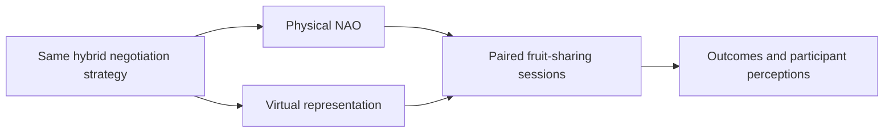

# Effects of Agent's Embodiment in Human-Agent Negotiations — [IVA 2023]

Umut Çakan · Mehmet Onur Keskin · Reyhan Aydoğan

[Paper](https://doi.org/10.1145/3570945.3607362) · [Explore the method](METHOD.md) · [Try the code](#try-it-yourself) · [Study guide](docs/protocol.md) · [Citation](#cite-the-paper)

[](https://github.com/monurkeskin/Effects-of-Agents-Embodiment-IVA-2023/actions/workflows/tests.yml)
[](https://doi.org/10.5281/zenodo.22728998)

**Would you bargain differently with a robot in the room than with its virtual counterpart?**

Caduceus uses the same negotiation strategy in two forms: a physical NAO robot and a virtual representation of it. The study asks how embodiment shapes both the offers people make and the way they perceive their negotiation partner.

## The idea

Participants negotiate in both embodiment conditions in counterbalanced order. They divide four types of fruit, with four units of each: **625 possible allocations**. The two sessions use different assignments of the same point values, and the agent uses a hybrid time/behavior strategy.



## In the paper

The paper reports higher social welfare and more collaborative human moves in the virtual condition, while participants perceived the physical robot as more humanlike. These are findings of the published human study, not results generated by the software example below. [Read the paper](https://doi.org/10.1145/3570945.3607362).

## Explore this work

Explore the fruit utility space, examine the two exact point profiles and follow a paired session sequence. Exhaustive profile checks cover all 625 allocations for each role and session.

| Explore | Start with | What it shows |
| --- | --- | --- |
| Fruit-sharing space | `reproduction/profile-1.json` | Recompute the full utility space from the paper's point table. |
| Second session | `reproduction/profile-2.json` | Inspect the changed profile assignment. |
| Embodiment protocol | `docs/protocol.md` | Keep practice, order, breaks and exclusions distinct. |

This repository holds the paper-specific configurations, method checks and study
guides. The shared [NEGOTIATOR framework](https://github.com/monurkeskin/NEGOTIATOR-IJCAI-2024) runs the negotiation,
participant/conductor views and session analysis. Its exact **2.0.0** revision is
pinned in [framework.json](framework.json); installation brings it in automatically.

The browser avatar provides a convenient demonstration; it is not the recorded virtual robot used in the study. The maintained mood schedule follows a historical code variant that differs from the paper's stated warning times. [METHOD.md](METHOD.md) and the protocol guide identify the remaining presentation/protocol choices.

## Try it yourself

Use Python 3.11 or 3.12 and Git. This first example runs locally without a robot,
camera or service account.

```bash
git clone https://github.com/monurkeskin/Effects-of-Agents-Embodiment-IVA-2023.git
cd Effects-of-Agents-Embodiment-IVA-2023
python3 -m venv .venv
source .venv/bin/activate
python -m pip install -r requirements.txt
python run.py --output demo-output
```

On Windows, create the environment with `py -3 -m venv .venv` and activate it with
`.venv\Scripts\Activate.ps1` in PowerShell.

Open **`demo-output/report/index.html`** to follow the example negotiation. The
output includes offers, utility trajectories, session records and exportable
figures. These are synthetic examples for exploring the software and method.
[Installation help](docs/compatibility.md).

### Read a calculation or open the study workspace

```bash
negotiator reproduce reproduction/method.json --output method-output
negotiator gui
```

In **New study → Import a paper or study configuration**, select
`configs/synthetic.json` for the demonstration, or `configs/protocol-template.json`
to inspect the paper's protocol template. The [study guide](docs/protocol.md)
explains the remaining protocol/asset requirements and device setup.

## Data and reproducibility

Participant-level records and audio/video recordings are **not distributed in this
repository**. Restricted access is compatible with sharing the method, protocol and
analysis code; it does not require releasing human-study data publicly. The package
provides synthetic inputs and documents which computations can be run from them.
Recomputing the published human-study statistics additionally requires authorized
access to the relevant inputs and the corresponding analysis specification.

[Reproducibility guide](REPRODUCIBILITY.md) · [Paper-to-code map](paper-map.json) ·
[Analysis guide](docs/analysis.md)

## Build on the work

To change a paper condition, start with its configuration and add a small test
showing the intended behavior. Shared negotiation rules belong in NEGOTIATOR;
paper-specific profiles, protocols and result recipes belong here. The
[development guide](docs/development.md) walks through these boundaries and the
test-first workflow. [Contribution guide](CONTRIBUTING.md).

## Cite the paper

If you use this method or study design, please cite the associated paper:

```bibtex
@inproceedings{agentembodiment2023,
  title = {Effects of Agent's Embodiment in Human-Agent Negotiations},
  author = {Çakan, Umut and Keskin, Mehmet Onur and Aydoğan, Reyhan},
  year = {2023},
  doi = {10.1145/3570945.3607362},
  url = {https://doi.org/10.1145/3570945.3607362}
}
```

The [citation file](CITATION.cff) provides the paper as the preferred citation.
For software provenance, also record the version and [archived 2.0.0 artifact](https://doi.org/10.5281/zenodo.22728998).
When using the shared engine in new research, cite the
[NEGOTIATOR framework paper](https://doi.org/10.24963/ijcai.2024/1012).
GPL-3.0-only; original contributors and sources are credited in [NOTICE](NOTICE).
